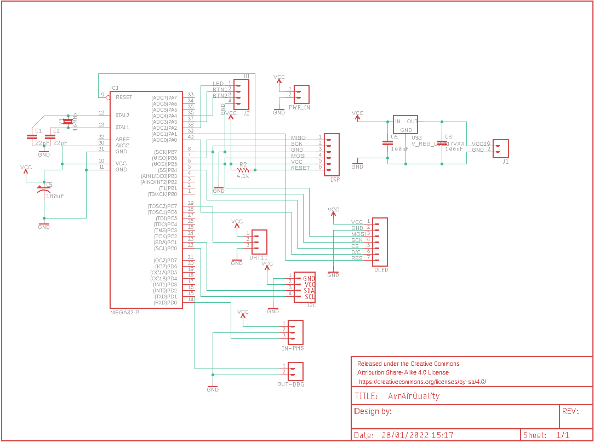

# avrAir_QMS

Air quality monitor backported from an original RaspberryPI project to AVR platform (Atmega32a), PMS5003 sensor and DHT11 temperature and humidity sensor.
In order to display the measurements it uses a 0.96" color OLED display (SSD1331 - SPI) through ssd1331 library from Waveshare.
For user interaction I've added a single page selection button, allowing to interact with the application and change the page displayed and therefore the data displayed.

## Building and Dependencies
I've developed the application using Microchip studio and a few libraries I've previously found on Github or websites, all MIT or similar license based (references are added to file headers) 
## Wiring

